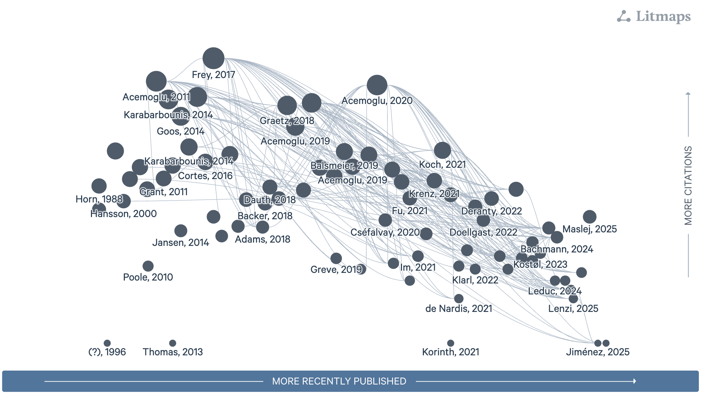

# Msc Thesis 

**Latest Research Question**
> Does robot adoption reduce employment in manufacturing industries, and to what extent do labor market institutions—specifically collective bargaining coverage and wage coordination—mediate this effect across countries and industries?

## Layout
Initial Tesing Folders:
- uncomtradev1 => replacing IFR with EU Import data
- ICTWSSv1 => adding collective bargaining 
- europev1 => broader test on EU data
- swedenv1 => quick test on sweden

## Literature Map

